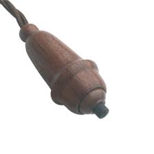

# Pera Inteligente - Smart BedSide Cord Switch

This project builds a small and portable device to switch ON/OFF the light of the (bed)room where its (unique) push button is pressed.
This is the 21st version of the older bedside cord switch used to operate ceil light ON/OFF at confort of the warm bed. : )

The "smart" part of the project is just its capability to sniff the "Air" for capture the neibourhood list of "ESP-xxxx" APs with their correspondent RSSI signal strength and publish it via MQTT. This data will processed by an external entity, which will, de facto, identify the right appliance to send the instructions for switch ON/OFF.

##
## --Hardware--
This device is based on Espressif **ESP8266** MCU.

The only physical operational interface available is a simple **Push Button**. Its job is just to Start the MCU (RST to GND shunt).

As it is battery powered, the MCU is kept in sleepmode as mush possible and is only waked to measure the ambient and to report those values. In order to reduce its size it is powered by a **LIR2450** Lithium Ion battey. The **Batt Charger** circuit is the typical module [USB Lithium Battery Charger Module Board With Charging And Protection] (https://www.banggood.com/USB-Lithium-Battery-Charger-Module-Board-With-Charging-And-Protection-p-924048.html) located externally. (Obviously), it won't benefit from module's battery protection circuit. Definitely, a TODO point to be solved in near future.

##
## --Software--
Being based on my [GitHub albkirk ESP8266_KickStart](https://github.com/albkirk/ESP8266_KickStart), which already included all code required for:
- Battery Level monitoring,
- Telnet debuging text output.
- Wi-Fi monitoring and WLAN network connectivity with Static IP addressing.
- MQTT registration, data subscription and publishing,
- Remote upgrade via OTA and/or HTTP update.
